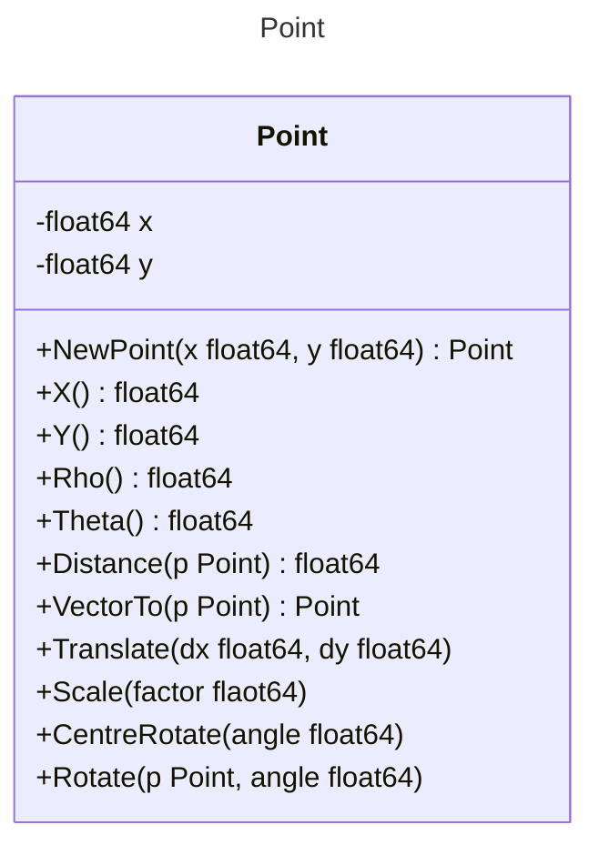

# Ylesanne1

## nn. Class diagramm

```mermaid
---
title: Point
---
classDiagram
    class Point{
        -float64 x
        -float64 y
        +NewPoint(x float64, y float64) Point
        +X() float64
        +Y() float64
        +Rho() float64
        +Theta() float64
        +Distance(p Point) float64
        +VectorTo(p Point) Point
        +Translate(dx float64, dy float64)
        +Scale(factor flaot64)
        +CentreRotate(angle float64)
        +Rotate(p Point, angle float64)
    }
```
